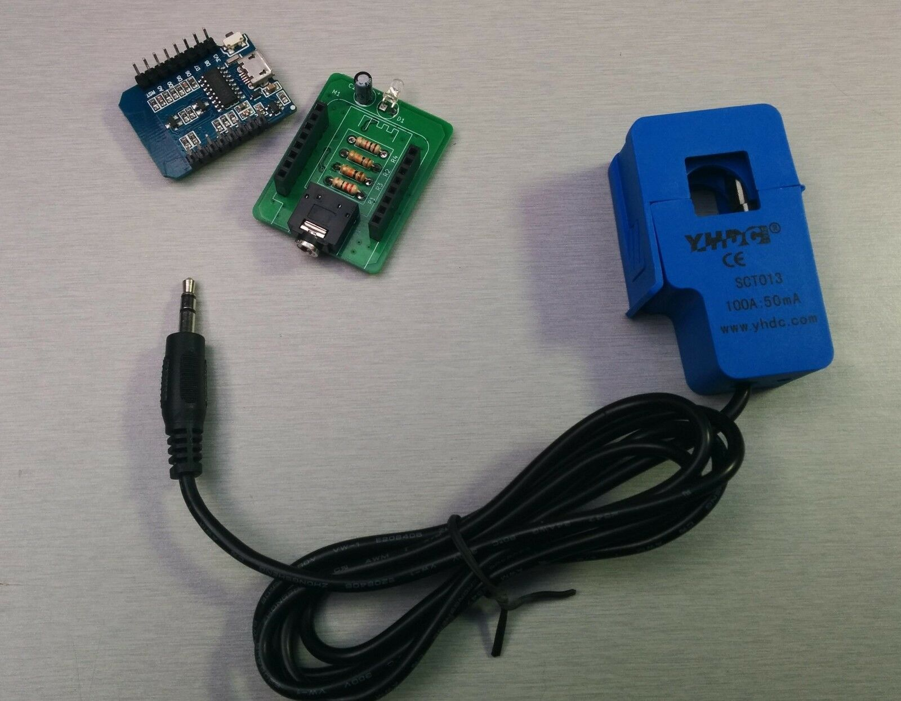
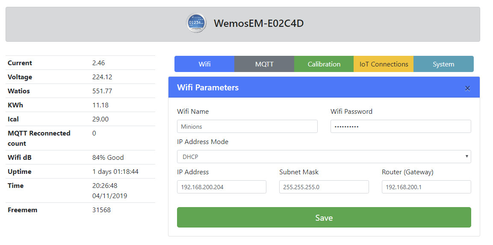
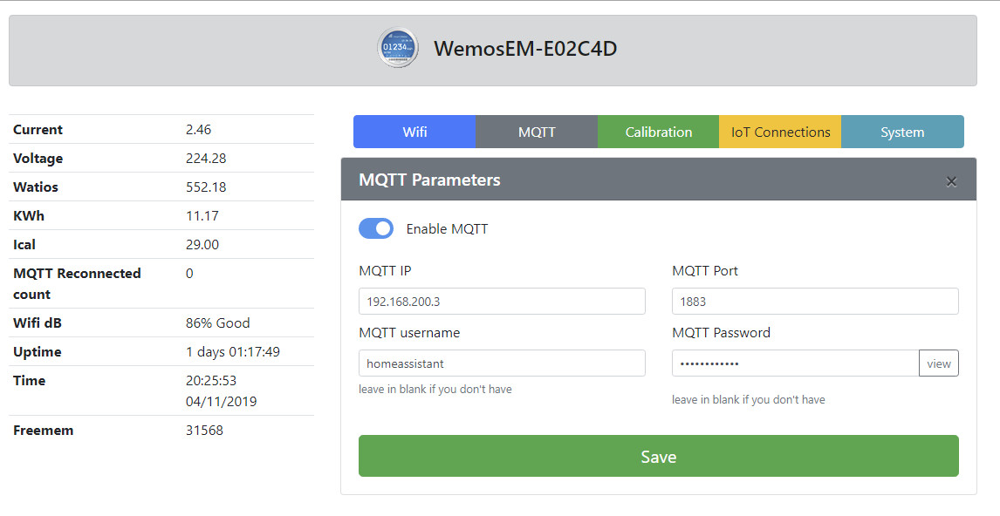
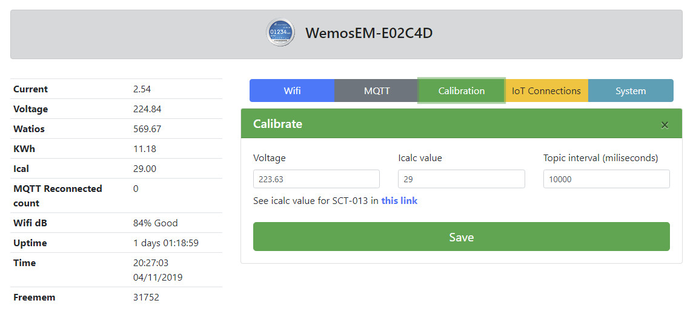
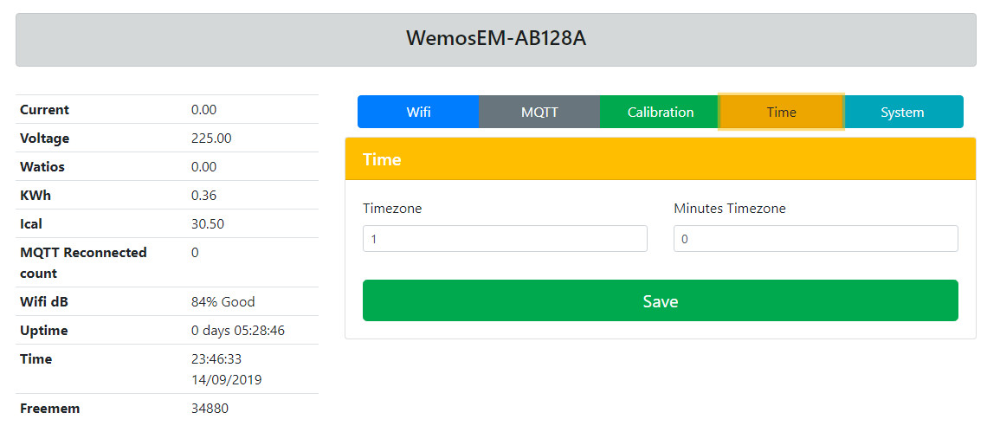
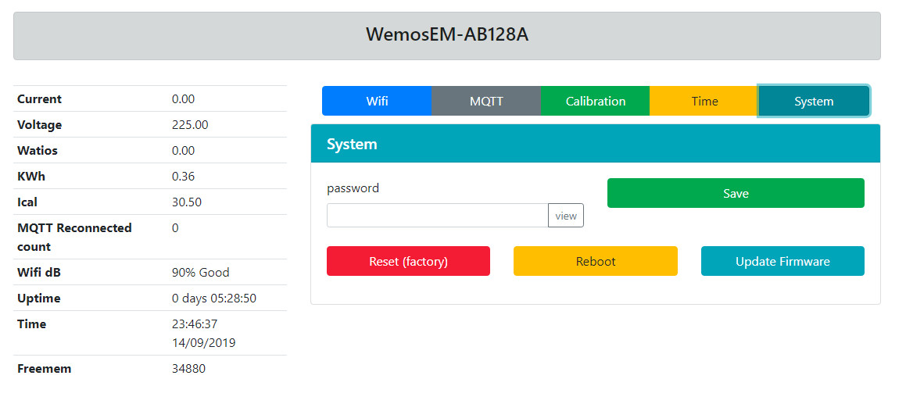

# WemosEM

This is a fork of [@nephiel](https://github.com/Nephiel/MQTT-Power-Sensor) and [@Mottramlabs](https://github.com/Mottramlabs/MQTT-Power-Sensor) projects

Thanks to Dawies [www.domology.es](https://domology.es/medidor-de-consumo-no-invasivo-con-sct013-wemos-d1/) for his contributions and his tutorial

The sensor uses a Wemos D1 Mini and a Non-invasive Split Core Current Transformer type 100A SCT-013-000, available on eBay.
You can use Current Transformer type calibrated SCT-013-030 (30A), SCT-013-050 (50A) and others. Recomended Clamp 30A or higger.

The sensor samples the current value every 10 seconds and publishes it to a topic via an MQTT broker. you can change this value up to 5 seconds
If the connection fails, it attempts to reconnect to the WiFi and/or the MQTT Broker as needed.

Original Gerber files for the PCB layout and the source files for Kicad are included, although there may be issues with the custom libraries used.

Device creates a WiFi named WemosEM-XXXXXX. You can use Phone or PC to setup. Wifi Password: infinito&masalla
* Default user: wemosem
* Default password: infinito&masalla

Password is updatable in configuration system tab.

**Software features:**

- Easy setup.
- Responsive design.
- Home Asisstant Discovery.
- All setup in web browser: Wifi, MQTT, Calibrate, timezone, update and system.
- Update Voltaje by MQTT topic.
- NTP to setup timezone.

#### Components: 
- Wemos D1 Mini
- [ESP8266 Mains Current Sensor](https://www.ebay.es/itm/ESP8266-Mains-Current-Sensor-Wemos-Current-transformer-SCT013-100A-50mA/133077015640)
- Current transformer SCT013 (Ebay or Aliexpress)
- Optional case: https://www.thingiverse.com/thing:3544702

**WARNING:** If you use calibrated clamp, **remove resistance R1** from mains current sensor.

## Setup in Home Assistant (without MQTT autodiscovery)
    
    sensor:
    - platform: mqtt
      state_topic: "wemos/wemosEM-29513D/power"
      name: WemosEM-Amperaje
      icon: mdi:current-ac
      unit_of_measurement: "A"
      value_template: "{{ value_json.current }}"
    - platform: mqtt
      state_topic: "wemos/wemosEM-29513D/power"
      name: WemosEM-Consumo Actual
      icon: mdi:power-plug
      unit_of_measurement: "W"
      value_template: "{{ value_json.watios }}"
    - platform: mqtt
      state_topic: "wemos/wemosEM-29513D/power"
      name: WemosEM-KWh
      icon: mdi:power-plug
      unit_of_measurement: "KWh"
      value_template: "{{ value_json.kwh }}"nt Cell  | Content Cell  |

## Update Voltaje with Home Assistant

if you have a Shelly EM, add a automation in Home assistant:
      
      - alias: Update voltage WemosEM
        initial_state: 'on'
        trigger:
        - platform: mqtt
          topic: shellies/shellyem-B9E2E9/emeter/0/voltage
    
        action:
        - service: mqtt.publish
          data_template:
            topic: "wemos-cmd/wemosEM-29513D/voltage"
            payload: '{{ trigger.payload }}'

if you have a device with Tasmota, add a automation in Home assistant:

      - alias: Update voltage Tasmota-WemosEM
        initial_state: 'on'
        trigger:
        - platform: mqtt
          topic: tele/sonoff01/SENSOR

        action:
        - service: mqtt.publish
          data_template:
            topic: "wemos-cmd/wemosEM-29513D/voltaje"
            payload: "{{ trigger.payload_json['ENERGY'].Voltage }}"

## Developers
- This project is developed with platformio.
- Compile this project with Arduino Core 2.4.2.

**Commands:**
- Compile: pio run
- Compile and upload Wemos D1: pio run -t upload

## Screenshots

