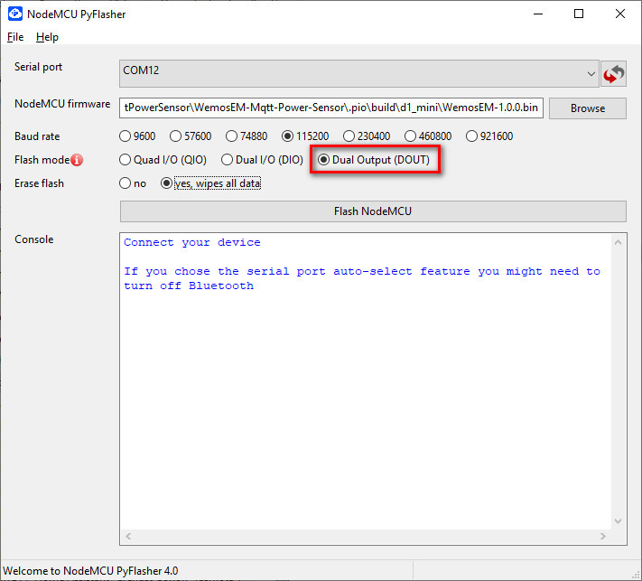
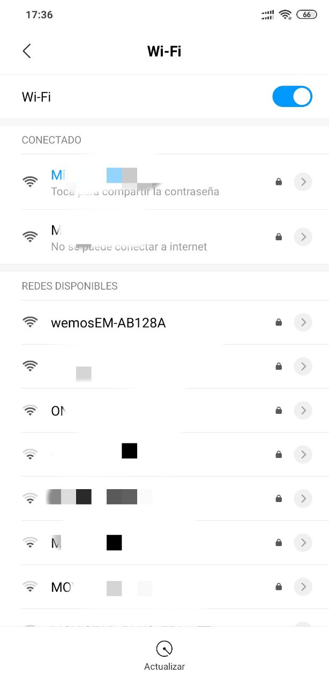
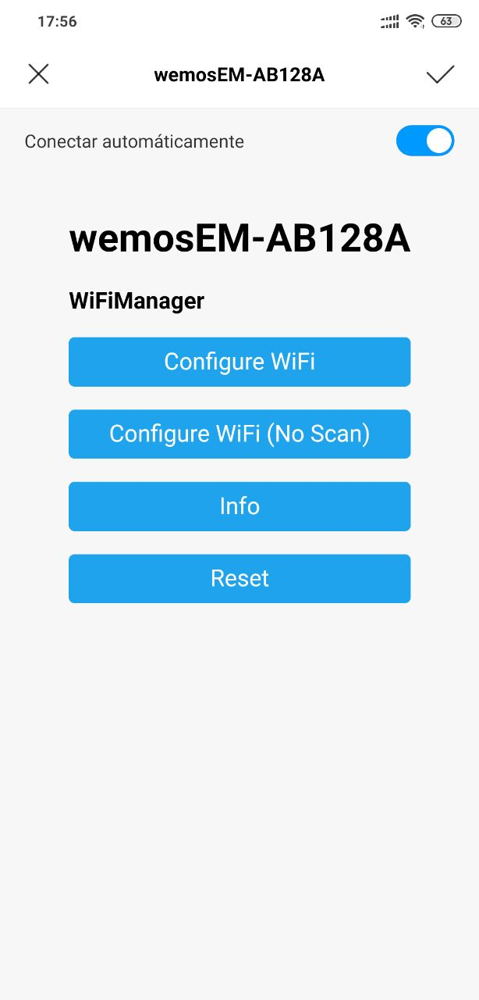
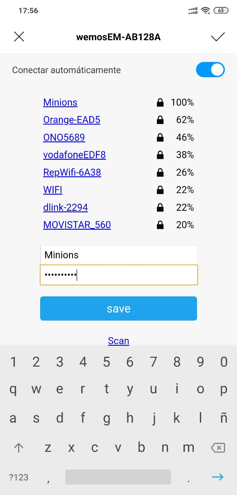
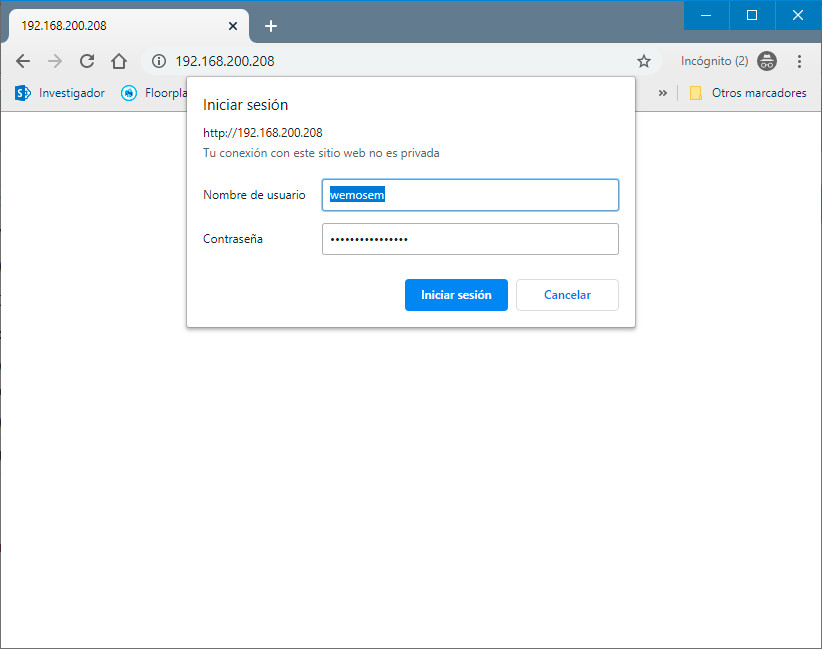

# WemosEM

This is a fork of [@nephiel](https://github.com/Nephiel/MQTT-Power-Sensor) and [@Mottramlabs](https://github.com/Mottramlabs/MQTT-Power-Sensor) projects

Thanks to Dawies [www.domology.es](https://domology.es/medidor-de-consumo-no-invasivo-con-sct013-wemos-d1/) for his contributions and his tutorial

The sensor uses a Wemos D1 Mini and a Non-invasive Split Core Current Transformer type 100A SCT-013-000, available on eBay.
You can use Current Transformer type calibrated SCT-013-030 (30A), SCT-013-050 (50A) and others. Recomended Clamp 30A or higger.

The sensor samples the current value every 10 seconds and publishes it to a topic via an MQTT broker. you can change this value up to 5 seconds
If the connection fails, it attempts to reconnect to the WiFi and/or the MQTT Broker as needed.

Original Gerber files for the PCB layout and the source files for Kicad are included, although there may be issues with the custom libraries used.

**Software features:**

- Easy setup.
- Responsive design.
- Home Asisstant Discovery.
- All setup in web browser: Wifi, MQTT, Calibrate, timezone, update and system.
- Update Voltaje by MQTT topic.
- NTP to setup timezone.

#### Components: 
- Wemos D1 Mini
- [ESP8266 Mains Current Sensor](https://www.ebay.es/itm/ESP8266-Mains-Current-Sensor-Wemos-Current-transformer-SCT013-100A-50mA/133077015640)
- Current transformer SCT013 (Ebay or Aliexpress)
- Optional case: https://www.thingiverse.com/thing:3544702

**WARNING:** If you use calibrated clamp, **remove resistance R1** from mains current sensor.

## Firmware installation and first setup

#### Flashing: 

Download latest [release](https://github.com/alcar21/WemosEM/releases)
You can flash using software [nodemcu-pyflasher](https://github.com/marcelstoer/nodemcu-pyflasher/releases)

1. Select Serial port (COM# port) where your serial-to-USB or NodeMCU/D1 mini is connected. Leave on auto-select if not sure.
2. Browse to the binary you downloaded from WemosEM releases.
3. Set Baud rate to 115200 and **Flash mode to DOUT**. Erase flash to **yes** if it is the first time flashing WemosEM on the device or you're experiencing issues with existing flash. If you're upgrading WemosEM set to no.
4. Click Flash NodeMCU and watch the progress in console.

If the flash was successful the console will display:
  Firmware successfully flashed. unplug/replug or reset device to switch back to normal boot mode

Unplug your adapter or device and plug it back in or connect to another power source. Your device is now ready for Initial configuration.

You can see in Tasmota project other options to flash: https://github.com/arendst/Sonoff-Tasmota/wiki/Flashing

#### Initial configuration

WemosEM provides a wireless access point for easy Wi-Fi configuration.

Connect your device to a power source and grab your smartphone (or tablet or laptop or any other web and Wi-Fi capable device). Search for a Wi-Fi AP named **wemosEM-xxxxxx** (where x is a last part of MAC) and connect to it with password **infinito&masalla**. In this example the Wi-Fi AP is named **wemosEM-AB128A**. When it connects to the network, you may get a warning that there is no Internet connection and be prompted to connect to a different network. Do not allow the mobile device to select a different network.

After you have connected to the WemosEM Wi-Fi AP, open http://192.168.4.1 in a web browser on the smartphone (or whatever device you used). Some devices might prompt you to sign in to Wi-Fi network which should also open the above address.

At this page you can have WemosEM scan for available Wi-Fi networks. Select and setup you wifi network. Click save and you wemos will connect to your wifi.

Finally, connect with IP or http://wemosem-xxxxxx.local/ and enter default user and passwor:

* **Default user: wemosem**
* **Default password: infinito&masalla**

Password is updatable in configuration system tab.

## Setup in Home Assistant (without MQTT autodiscovery)
    
    sensor:
    - platform: mqtt
      state_topic: "wemos/wemosEM-XXXXXX/power"
      name: WemosEM-Amperaje
      icon: mdi:current-ac
      unit_of_measurement: "A"
      value_template: "{{ value_json.current }}"
    - platform: mqtt
      state_topic: "wemos/wemosEM-XXXXXX/power"
      name: WemosEM-Consumo Actual
      icon: mdi:power-plug
      unit_of_measurement: "W"
      value_template: "{{ value_json.watios }}"
    - platform: mqtt
      state_topic: "wemos/wemosEM-XXXXXX/power"
      name: WemosEM-KWh
      icon: mdi:power-plug
      unit_of_measurement: "KWh"
      value_template: "{{ value_json.kwh }}"nt Cell  | Content Cell  |

## Update Voltaje with Home Assistant

if you have a Shelly EM, add a automation in Home assistant:
      
      - alias: Update voltage WemosEM
        initial_state: 'on'
        trigger:
        - platform: mqtt
          topic: shellies/shellyem-B9E2E9/emeter/0/voltage
    
        action:
        - service: mqtt.publish
          data_template:
            topic: "wemos-cmd/wemosEM-XXXXXX/voltage"
            payload: '{{ trigger.payload }}'

if you have a device with Tasmota, add a automation in Home assistant:

      - alias: Update voltage Tasmota-WemosEM
        initial_state: 'on'
        trigger:
        - platform: mqtt
          topic: tele/sonoff01/SENSOR

        action:
        - service: mqtt.publish
          data_template:
            topic: "wemos-cmd/wemosEM-XXXXXX/voltaje"
            payload: "{{ trigger.payload_json['ENERGY'].Voltage }}"

## Developers
- This project is developed with platformio.
- Compile this project with Arduino Core 2.4.2.

**Commands:**
- Compile: pio run
- Compile and upload Wemos D1: pio run -t upload

## Tests

## Screenshots

